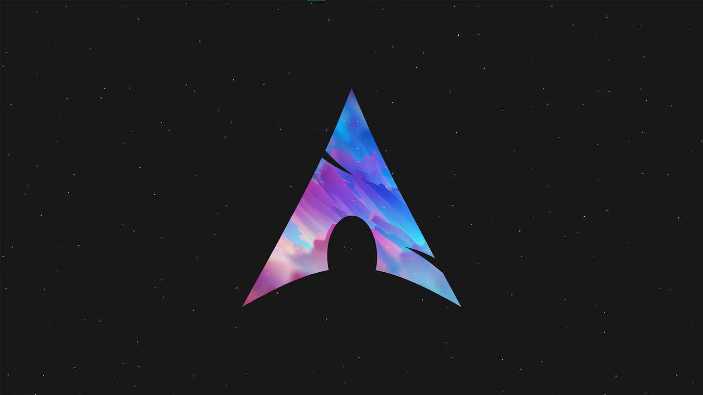
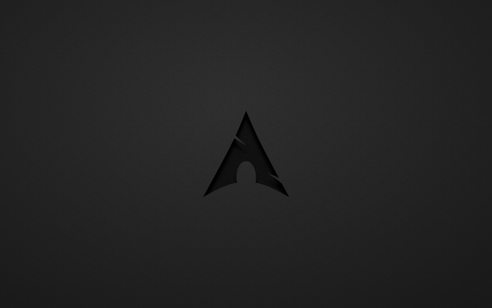

# Autobspwm

**Autobspwm** is an automation script designed to configure and personalize a tiling window manager setup using **bspwm**, **kitty**, and **sxhkd** on Debian/Ubuntu-based systems.


## Features

- Automatic installation of `bspwm`, `kitty`, and `sxhkd`
- Custom terminal setup using `powerlevel10k` and other enhancements
- Preconfigured keybindings via `sxhkd`
- Script for easily changing wallpapers
- Font and theme setup for a visually appealing desktop

## Compatibility

This script has been tested on the following Linux distributions:

- ✅ Parrot OS
- ✅ Kali Linux
- ✅ Ubuntu (22.04+)

It is designed for Debian-based systems. Use on other distributions may require modifications.

## Installation

1. Clone the repository:

    ```bash
    git clone https://github.com/JCreiv/Autobspwm.git
    cd Autobspwm
    ```

2. Make the installer executable

    ```bash
    chmod +x install.sh
    ```

3. Run the installer

    ```bash
    ./install.sh
    ```

4. Follow the prompts during installation to complete the setup.

## Usage

After installation, log out of your current session and choose **bspwm** as your window manager from your display manager.


## Configuration

- All configuration files are located in the `config/` directory:
    
    - `bspwmrc` (for bspwm)
        
    - `sxhkdrc` (for keybindings)
        
    - `kitty.conf` (for terminal appearance)
        
- Wallpapers are stored in the `Wallpapers/` directory. You can add your own images there.

## Wallpaper Management

To change the desktop wallpaper, this project includes a script called `wallpaper.sh`.  
It provides a simple interactive menu to select from predefined wallpapers located in the `Wallpapers/` directory.

### Usage

```bash
chmod +x wallpaper.sh
./wallpaper.sh
```

# [THEMES]

## Archkali


## Arch


## BlackArch


## Lsd


## Parrot


## Purple


## S4vitar

## License

This project is licensed under the MIT License.
